# E-Learning Platform

This e-learning platform allows students to purchase courses, chat with instructors, participate in video calls, take exams, and earn certificates upon course completion.

## Features

### 1. Homepage
The homepage provides an overview of the available courses and general information about the platform.

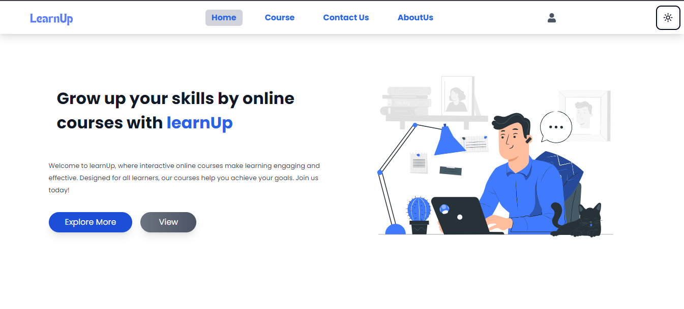

### 2. Course Listing
This page lists all available courses, allowing students to browse and select courses to purchase.


### 3. Course Details
Each course has a dedicated page that displays detailed information such as the course description, lessons, and pricing.


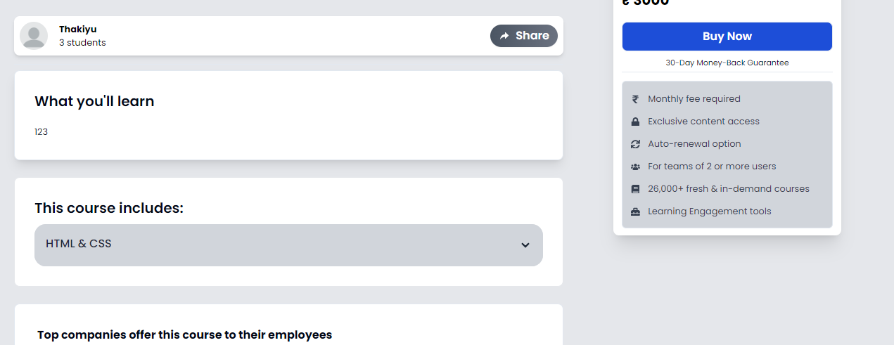

### 4. Add Course
For instructors, adding courses is streamlined with simple forms for course content, objectives, and pricing.

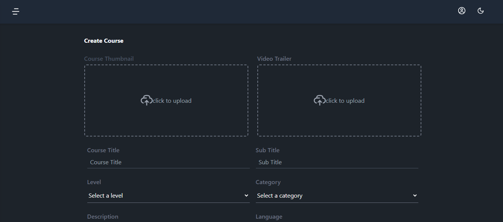
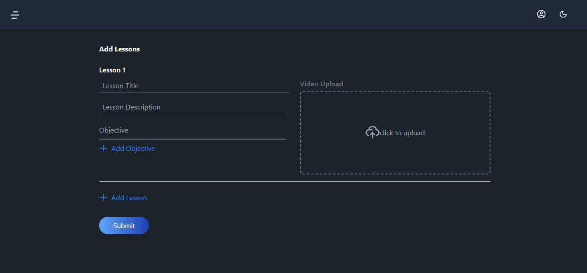

### 5. Enrolled Courses
Students can view their enrolled courses and continue learning from the dashboard.

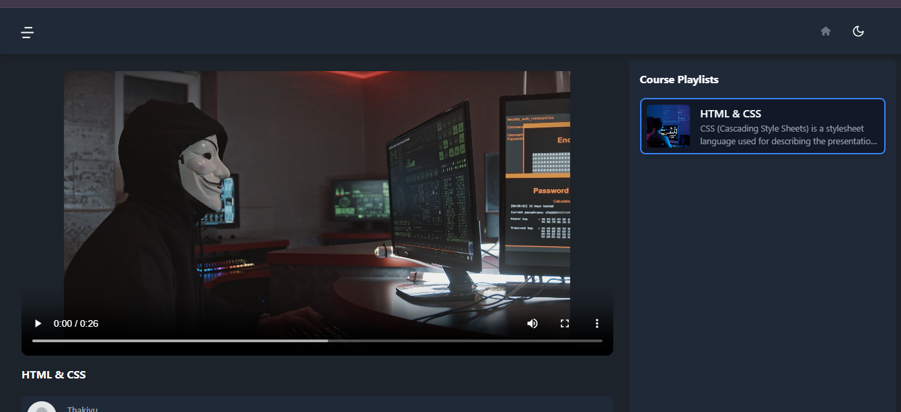

### 6. Assessments and Exams
Students can take assessments and exams throughout the course.

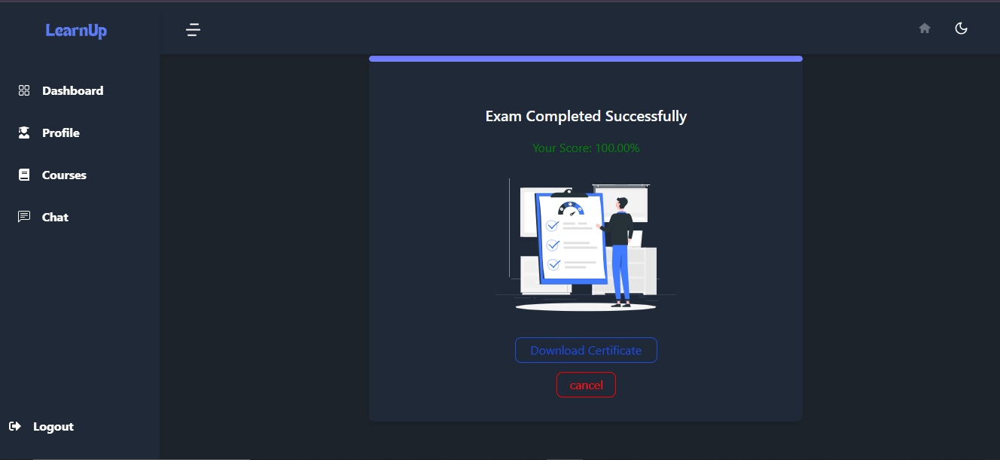

### 7. Chat and Video Call
Students and instructors can engage through a chat system and video call functionality for real-time communication.

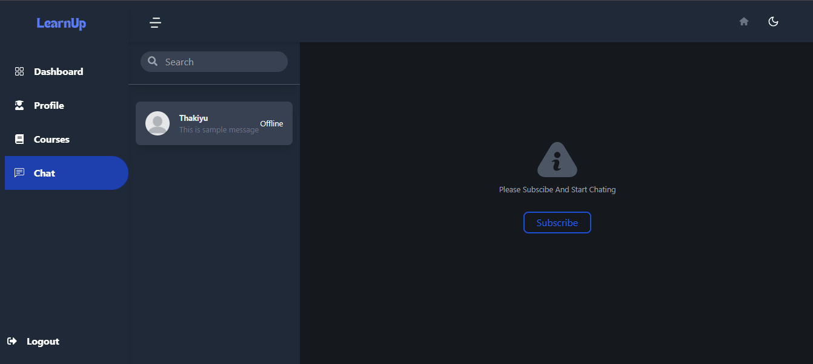

### 8. Subscription and Payment
Students can purchase individual courses or subscribe to multiple courses through a secure payment gateway.

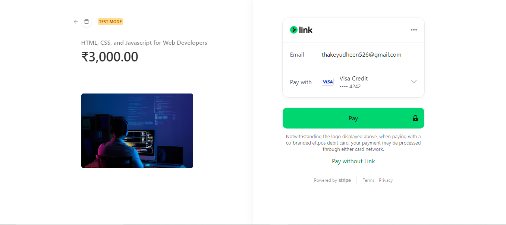
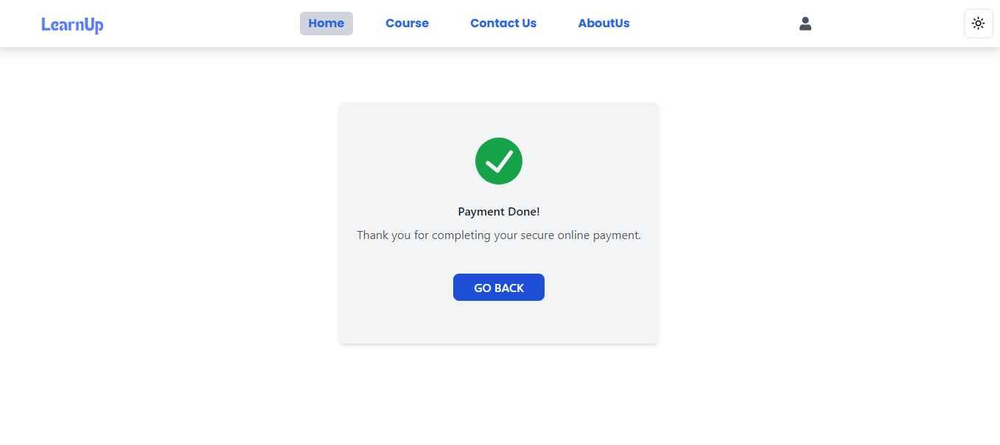

### 9. User Profile
Each user has a profile section to manage their details, including purchased courses and subscription status.

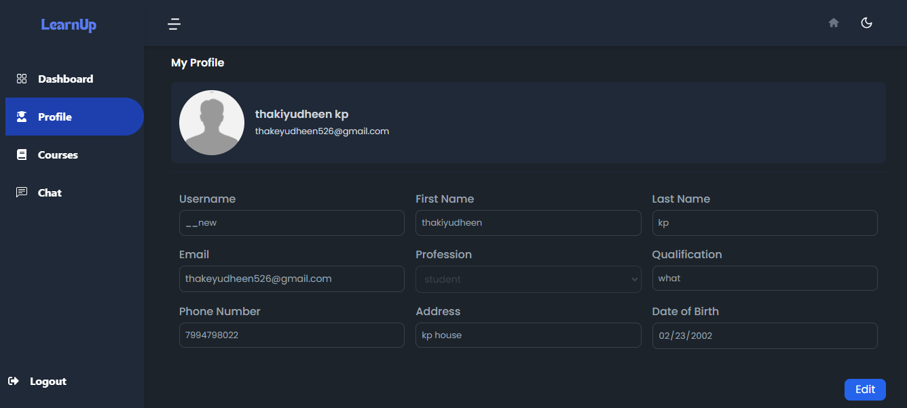

### 10. Certificate
Upon completing the course, students are awarded a certificate that can be downloaded.


### 11. Footer
The footer provides additional navigation links and information about the platform.

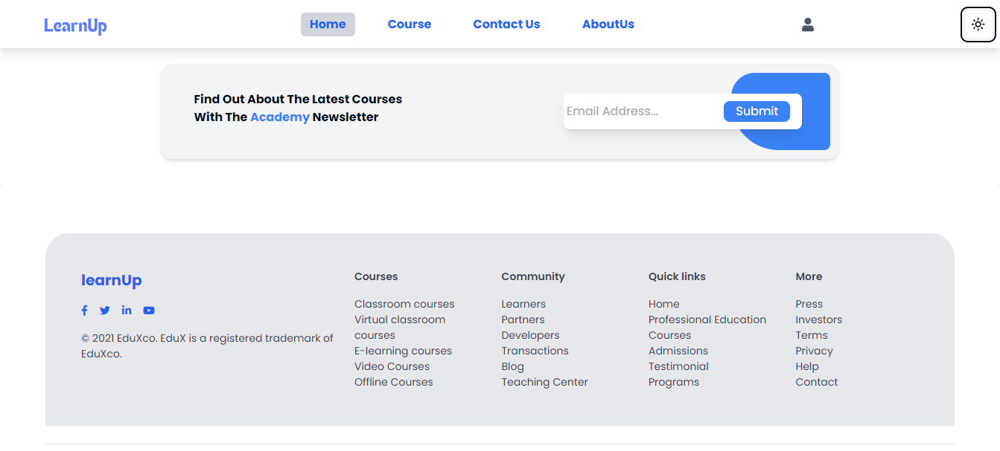

---

## Installation

To set up the platform locally, follow these steps:

1. Clone the repository:
   ```bash
   git clone https://github.com/your-repository-url.git
